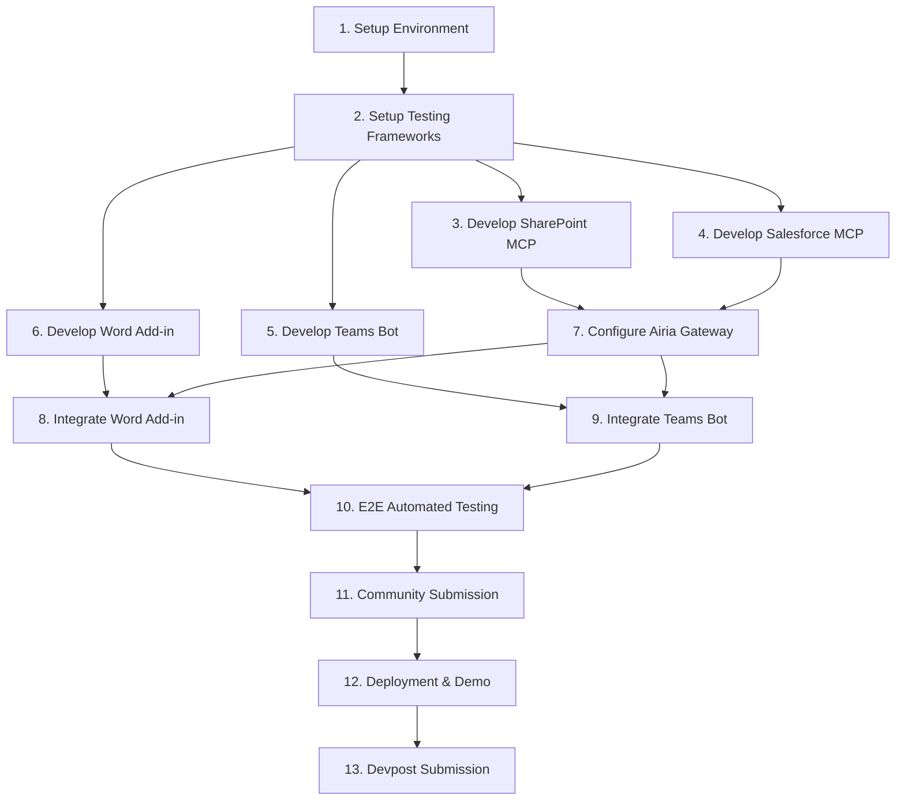

# TenderWin Implementation Plan

## Architecture & TDD Strategy
We will use a **Turborepo** monorepo structure to house the Word Add-in, Teams Bot, and custom MCP servers. Every component will follow a strict Test-Driven Development (TDD) lifecycle:
1. Write failing tests (Unit/Integration) before writing application code.
2. Implement the minimum code to pass the tests.
3. Refactor.

## Dependency DAG

## Detailed Tasks

### Phase 1: Foundation (Strict TDD Base)

#### Task 1: Setup Environment
- **Details:** Initialize Turborepo. Create the required packages: `apps/word-addin`, `apps/teams-bot`, `packages/mcp-sharepoint`, `packages/mcp-salesforce`.
- **Testing:** Add a simple health check script to ensure all packages can be built concurrently using `turbo run build`.

#### Task 2: Setup Testing Frameworks
- **Details:** Install and configure all required testing tools.
- **Unit Testing:** Install `jest` globally. Configure `jest.config.js` in each package.
- **Frontend Testing:** Install `@testing-library/react` and `@testing-library/jest-dom` in `apps/word-addin/package.json`.
- **E2E Testing:** Install `@playwright/test` in a new `tests/e2e` folder.
- **Bot Testing:** Install `botbuilder-testing` in `apps/teams-bot/package.json`.
- **CI/CD:** Configure GitHub Actions (`.github/workflows/ci.yml`) to run `npm test`, `npm run lint`, and `npx playwright test` on every commit.

### Phase 2: Backend & AI Integrations

#### Task 3: Develop SharePoint MCP Server (TDD)
- **Details:** Create a Model Context Protocol (MCP) server that connects to SharePoint to retrieve past proposals for semantic search.
- **Unit Tests (`packages/mcp-sharepoint/src/index.test.ts`):** 
  - Write tests for the schema validation of the tool inputs.
  - Write tests to assert the server correctly parses and returns mock SharePoint API responses.
- **Implementation (`packages/mcp-sharepoint/src/index.ts`):** 
  - Use the `@modelcontextprotocol/sdk`. Implement the `CallToolRequest` handler to securely query the SharePoint API and return documents formatted as MCP resources.

#### Task 4: Develop Salesforce MCP Server (TDD)
- **Details:** Create an MCP server that connects to Salesforce to retrieve current client context for the RFP.
- **Unit Tests (`packages/mcp-salesforce/src/index.test.ts`):** 
  - Write tests to assert client context extraction logic.
  - Write tests for error handling (e.g., Salesforce API downtime).
- **Implementation (`packages/mcp-salesforce/src/index.ts`):** 
  - Use the `@modelcontextprotocol/sdk`. Implement tools that allow the Airia Agent to fetch Account and Opportunity data.

#### Task 5: Configure Airia Gateway & Agent Constraints
- **Details:** Register the custom MCP servers on the Airia Gateway. Set up the core Airia Agent using the Agent Builder.
- **Security & Constraints:** Apply Agent Constraint policies to restrict data exfiltration (e.g., blocking external emails). Ensure Role-Based Access Control (RBAC) is configured via OAuth pass-through.
- **Integration Tests:** Write automated scripts (using `axios` or similar) to simulate Airia Gateway routing to the local MCP servers and validating that access constraints block unauthorized requests.

### Phase 3: Frontend & Bot Interfaces

#### Task 6: Develop Microsoft Teams Bot (TDD)
- **Details:** Build a conversational bot using the Microsoft Bot Framework that facilitates the "Ping Expert" workflow.
- **Unit Tests (`apps/teams-bot/src/bot.test.ts`):** 
  - Use BotBuilder's `TestAdapter` to simulate a user asking for approval (*"Hey Sarah..."*) and assert the bot's expected reply.
  - Test state management to ensure approval events are correctly formatted.
- **Implementation (`apps/teams-bot/src/bot.ts`):** 
  - Implement proactive messaging to reach out to experts. Handle adaptive cards for rich approval UI.

#### Task 7: Develop Word Add-in UI (TDD)
- **Details:** Build the React-based task pane for Microsoft Word.
- **Unit Tests (`apps/word-addin/src/taskpane/components/App.test.tsx`):** 
  - Use `@testing-library/react` to render the task pane. Assert that the "Draft Answers" button exists.
  - Test that the interactive citation widget renders correctly when provided with mock MCP App data.
- **Implementation (`apps/word-addin/src/taskpane/components/App.tsx`):** 
  - Scaffold using `yo office`. Build the React sidebar. Create the UI components for confidence scores and clickable citations.

### Phase 4: Integration & E2E Testing

#### Task 8: Integrate Word Add-in with Airia Backend & Office.js
- **Details:** Connect the Word Add-in to the Airia Agent endpoint and wire up the Microsoft Office JavaScript APIs.
- **Integration Tests:** Mock the `Office.js` context. Write tests asserting that when an API response is received from Airia, the `Office.context.document.setSelectedDataAsync` method is called with the correct text.
- **Implementation:** Implement the logic to scan the document, send the context to Airia, and stream the drafted answers back into the Word document at the cursor's location.

#### Task 9: Integrate Teams Bot with Airia Agent Workflow
- **Details:** Create an event bridge between the Airia Agent and the Teams Bot.
- **Integration Tests:** Assert that a "Ping Expert" action triggered from the Word Add-in successfully dispatches a web-hook to the Teams Bot, and that the expert's response successfully resolves the agent's waiting state.
- **Implementation:** Set up webhooks and handle the asynchronous conversational handoff between the Word Add-in, Airia, and Teams.

#### Task 10: E2E Automated Testing for User Flows
- **Details:** Verify the entire system from the user's perspective using Playwright.
- **E2E Tests (`tests/e2e/word-addin.spec.ts`):** 
  - Load the Word Add-in in a mocked browser environment or Office on the web.
  - Simulate the full user flow: The user opens the sidebar, clicks "Draft Answers".
  - Intercept network requests to mock the Airia backend response.
  - Assert that the text is inserted into the document editor.
  - Verify that the interactive MCP Apps citation UI is clickable and expands to show the correct source snippet.

### Phase 5: Hackathon Submission & Demo

#### Task 11: Agent Configuration & Community Submission
- **Details:** Publish the agent to the Airia Community to be eligible for prizes.
- **Implementation:**
  - Finalize the agent name ("TenderWin").
  - Create a compelling Project Description (Problem, Solution, Features, Tech, Target Users).
  - Publish the agent to the Airia Community with "Public" visibility.
  - Retrieve the Community URL for the Devpost submission.

#### Task 12: Deployment & Demo Preparation
- **Details:** Deploy the infrastructure and record the submission video.
- **Implementation:** 
  - Host the Word Add-in static assets on Vercel/Netlify.
  - Deploy the Teams Bot and MCP Servers to a platform like Render or Azure App Service.
  - Record the demo video (Maximum 4 minutes, hosted on YouTube/Vimeo, realtime/not slides, narration/captions). Ensure it highlights Airia Everywhere integration, MCP Apps UI, and Airia security constraints.
  
#### Task 13: Final Devpost Submission
- **Details:** Submit all required materials to the Devpost hackathon page.
- **Implementation:**
  - Submit the Agent Name.
  - Submit the Project Description.
  - Submit the Demo Video link (YouTube/Vimeo).
  - Submit the Airia Community URL.
